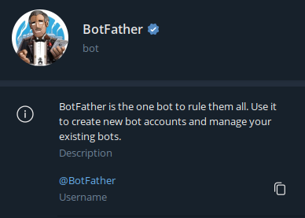
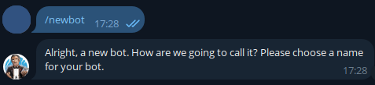
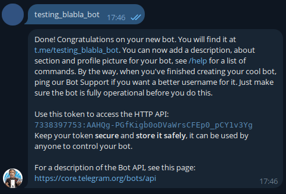

<p align="center">
    <em>Receba informações do próximo jogo em seu celular</em>
</p>
<div align="center">
<a href="https://github.com/LecoOliveira/Palmeiras_News/blob/main/LICENSE" target="_blank">

</a>
<a href="https://codecov.io/github/LecoOliveira/Palmeiras_News" target="_blank">

</a>
<a href="https://github.com/LecoOliveira/Palmeiras_News/actions" target="_blank">

</a>
</div>

---
**Código fonte:** <a href="https://github.com/LecoOliveira/Palmeiras_News" target="_blank">https://github.com/LecoOliveira/Palmeiras_News</a>

---
Palmeiras news é um projeto para estudo e aprendizado de Python e suas bibliotecas.

Este projeto consiste em um script automatizado que realiza web scraping no site oficial do Palmeiras para obter informações sobre o próximo jogo do time. Utilizando um bot do Telegram, o script envia essas informações diretamente para os usuários interessados. Todo o processo é totalmente automatizado, incluindo a verificação da data e hora do jogo, armazenamento dos dados e envio das informações via Telegram.

---
## Instalação

Para fazer a instalação usaremos o pip:

<div class="termy">

```bash
$ pip install palmeiras-news

---> 100%
palmeiras-news instalado com sucesso
```

</div>

---
## Como usar

Por ser um script simples, e fazer tudo sozinho depois que é inicializado. As únicas coisas que vai precisar fazer
é configurar suas variáveis de ambiente onde serão armazenadas as credenciais do seu bot do Telegram.

Caso queira pode usar o `--help` para receber uma ajuda rápida:

<div class="termy">

```bash
$ palmeiras --help

 Usage: palmeiras [OPTIONS] COMMAND [ARGS]...

╭─ Options ───────────────────────────────────────────────────────────────────────╮
│ --help                                                Show this message and     │
│                                                       exit.                     │
╰─────────────────────────────────────────────────────────────────────────────────╯
╭─ Commands ──────────────────────────────────────────────────────────────────────╮
│ bot_token    Configura o BOT_TOKEN na variável de ambiente.                     │
│ delete       Comando que deleta uma variável de ambiente do arquivo.            │
│ listar       Lista todas as variáveis de ambiente cadastradas                   │
╰─────────────────────────────────────────────────────────────────────────────────╯
```
</div>
<center><sup>*Logo de cara, podemos observar todos os comandos de configuração listados na sessão `Commands`*.</sup></center>

---

### Obtendo credenciais

Vamos começar criando o nosso bot. E para que isso, você precisará visitar o [@BotFather](https://telegram.me/BotFather) no Telegram. O processo é bem simples, e você pode ver o tutorial completo [aqui](https://core.telegram.org/bots/features#creating-a-new-bot).

<div align="center">
    
</div>

Depois de dado o comando `/start` no **BotFather**, dê o comando `/newbot`. Então ele pedirá para você escolher um nome para o seu bot. Aqui você pode colocar o nome que preferir.

<div align="center">
    
</div>

Agora, ele solicitará que você forneça um nome de usuário que obrigatoriamente deve terminar com `bot` e ser único. Portanto, escolha um nome apropriado até que seja aprovado.

<div align="center">
    
</div>

Pronto! Nosso bot já está criado. Veja que ele já nos retorna o link para acessarmos nosso bot, e também nos fornece o token que vamos utilizar na nossa aplicação.
Com o bot já criado, acesse o link que o **@BotFather** te deu, e clique em `Start`. 

Repare que nada acontecerá, pois o bot está esperando para receber instruções. E como no nosso caso ele só está lá para receber nossas informações do Palmeiras, está tudo certo.
Antes de irmos para nossa aplicação de fato, **envie uma mensagem aleatória qualquer para o bot**, só para ter algum registro e podermos capturar o id do seu usuário mais pra frente.
---
### Configurando variáveis

Com as credenciais em mãos, é hora de inseri-las no código.


É importante manter as credenciais da conta Twilio seguras, armazenando-as de maneira a impedir o acesso não autorizado. Um método comum é armazená-las em variáveis de ambiente que são acessadas no seu aplicativo. Isso os mantém fora do código e de outros lugares onde onde poderiam ser acessadas sem autorização.

Para adicionar as variáveis automaticamente no nosso arquivo, temos os seguintes comandos no CLI do nosso programa que precisarão ser configurados antes de rodar o programa pela primeira vez: ```sid```,  ```token```, ```twilio-phone``` e ```destiny-phone```.

///warning | Importante
Você só pode adicionar um SID, um TOKEN e um TWILIO_PHONE, então cuidado ao adicioná - los. Caso erre ao configurá-los, 
você pode usar a opção `delete` para deletar e configurar novamente.
///

Para configurar a sua credencial (seja ela o `sid`, `token` ou `twilio-phone`) digite no seu terminal o comando `palmeiras` seguindo da credencial que deseja adicionar, como no exemplo a seguir:

<div class="termy">

```bash
$ palmeiras sid SEU_ACCOUNT_SID

---> 100%
[15:44:12] TWILIO_ACCOUNT_SID configurado com sucesso!

```
</div>
<center><sup>*Faça isso para todas as credenciais*</center></sup>

---

Já no caso do `destiny-phone`, é possível adicionar um ou mais números por vez. Para ele digite os números que deseja adicionar separados por espaços:

<div class="termy">

```bash
$ palmeiras destiny-phone SEU_DESTINY_PHONE1 SEU_DESTINY_PHONE2

---> 100%
[20:59:45] TWILIO_DESTINY_PHONE_NUMBER SEU_DESTINY_PHONE1 SEU_DESTINY_PHONE2 configurado(s) com sucesso.
```
</div>

/// tip | Atenção
Importante lembrar, que todos os `destiny_phone` devem ser cadastrados e devidamente ativados no seu painel da Twilio. Sem isso, eles não receberão as mensagens.
/// 

E sim, para cada número cadastrado, será cobrado pela mensagem enviada. A ideia inicial é para que seja um projeto simples, pessoal. E para isso os créditos dados como teste pela Twilio já ajudarão. Mas caso goste e queira continuar usando, pode comprar mais créditos, fica bem barato cada mensagem (consulte a [tabela de preços](https://www.twilio.com/pt-br/sms/pricing/br)).

---
### Listando variáveis

Depois de configuradas suas variáveis de ambiente, você pode visualizá-las para confirmar se foram configuradas de forma correta.
Para isso, use o comando `listar`. Se não passar nenhuma flag será retornado todas as variáveis cadastradas:

<div class="termy">

```bash
$ palmeiras listar

[21:37:23] TWILIO_AUTH_TOKEN="e5xxxxxxxxxxxxxxxxxxxxxxxxxxxxx"
           TWILIO_ACCOUNT_SID="ACxxxxxxxxxxxxxxxxxxxxxxxxxxxxxxxx"              
           TWILIO_DESTINY_PHONE_NUMBER="+55xxxxxxxxxxx"                         
           TWILIO_PHONE_NUMBER="+127xxxxxxxx"
```
</div>

Para listar uma variável específica digite a flag da mesma:
<div class="termy">

```bash
$ palmeiras listar --sid

[11:41:16] TWILIO_ACCOUNT_SID="ACxxxxxxxxxxxxxxxxxxxxxxxxxxxxxxxx"
```
</div>
<center><sup>*Se houver dúvidas use o `palmeiras listar --help`*</center></sup>

---

### Deletando variáveis

Caso queira deletar ou reconfigurar alguma variável, você pode usar o comando `delete` seguido pela flag da variável que deseja alterar. 
Como no exemplo `--twilio-phone`:

<div class="termy">

```bash
$ palmeiras delete --twilio-phone

---> 100%
[22:00:38] TWILIO_PHONE_NUMBER removido com sucesso.
```
</div>

///warning | Cuidado
O programa precisará de todas as variáveis para funcionar, então não esqueça de cadastrar outra após deletar a anterior.
///

---

## Rodando o programa

Depois de cadastrada todas as credenciais, é só rodar o comando no terminal:

``` { .bash .copy }
palmeiras-run &
```
Nosso app ficará rodando em segundo plano, esperando para serem executadas as tasks.